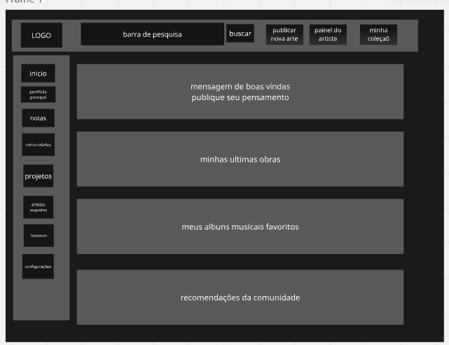
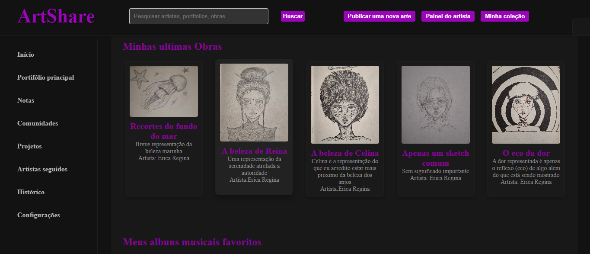

# Trabalho Prático - Semana 03

Dessa vez, vamos escolher uma proposta de projeto para trabalhar.

Nessa atividade, você deverá montar a página inicial do projeto escolhido, a organização do HTML aplicando semântica correta e uso aprimorado do CSS. Leia o enunciado completo no Canvas para mais detalhes.

**IMPORTANTE:** Você deve trabalhar e alterar apenas arquivos dentro da pasta **`public`**. Deixe todos os demais arquivos e pastas desse repositório inalterados. **PRESTE MUITA ATENÇÃO NISSO.**

## Informações Gerais

- Nome: Erica Regina da Silva Martins 
- Matricula: 00905541
- Proposta de projeto escolhida: Pessoas e produções 
- Breve descrição sobre seu projeto: Meu projeto é criar uma rede que sirva de portifolio online para artistas, viabilizar a criação de comunidades para a disseminação de diferentes formas de arte, epor meio de recomendações das comunidades disseminar curiosidades sobre obras de artistas famosos, vivos ou não. Além disso, por meio do compartilhamento de albuns de musicas, garantir a identificação de gostos em comum. 

## Print do(s) wireframe(s) criado

## Print da home-page criada

